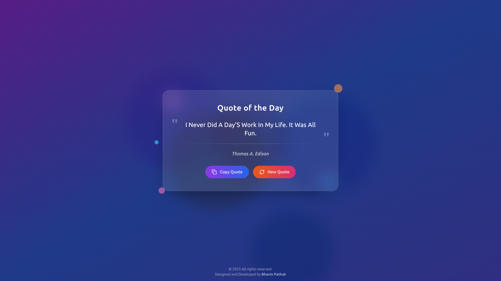

# Inspirebox 🌟

A beautiful, responsive Random Quote Generator built with **React**, **Tailwind CSS** Features stunning neon light effects and glassmorphism design.



## ✨ Features

- 🎨 **Beautiful Neon Light Effects** - Purple, blue, and orange animated background
- 🔮 **Glassmorphism Design** - Modern glass-like card with blur effects
- 📱 **Fully Responsive** - Perfect on mobile, tablet, and desktop
- 🔄 **Fresh Quotes on Refresh** - New inspirational quote every page reload
- 📋 **Copy to Clipboard** - One-click quote copying functionality
- 🎭 **Smooth Animations** - Fade-in effects and hover interactions

## 🚀 Quick Start

### Local Setup

```bash
# Clone the repository
git clone https://github.com/Bhavin-Pathak/inspirebox.git
cd inspirebox
```

### Install Packages And Start React-app

```bash
# Install dependencies
npm install

# Start development server
npm start

# Open http://localhost:3000
```

## 📁 Project Structure

```
inspirebox/
├── public/
│   ├── index.html
│   └── manifest.json
├── src/
│   ├── components/
│   │   └── inspirebox.js
│   ├── App.js
│   ├── App.css
│   ├── index.js
│   └── index.css
├── package.json
├── tailwind.config.js
├── postcss.config.js
└── README.md
```

## 🛠️ Tech Stack

- **Frontend**: React 18, Tailwind CSS
- **Icons**: Lucide React
- **API**: DummyJSON Quotes API
- **Build Tool**: Create React App

## 🎨 Design Features

### Neon Light Background

- Animated purple, blue, orange, pink, and cyan light orbs
- Smooth pulsing animations with staggered delays
- Mix-blend-multiply for authentic neon glow effects

### Glassmorphism Card

- Backdrop blur with transparency
- Subtle border and shadow effects
- Responsive padding and sizing

### Interactive Elements

- Hover animations on copy button and new quote button
- Scale and glow effects
- Smooth state transitions

## 📱 Responsive Design

- **Mobile**: Optimized touch targets and readable text
- **Tablet**: Balanced layout with proper spacing
- **Desktop**: Full neon effect experience with larger elements

## 🔧 Configuration

### Environment Variables

No environment variables required - the app fetches quotes directly from the public API.

### Customization

Edit `src/components/inspirebox.js` to:

- Change color schemes
- Modify animations
- Add new features
- Customize API endpoints

## 🔄 API Integration

Uses the **DummyJSON Quotes API**:

- Endpoint: `https://dummyjson.com/quotes/random`
- No API key required
- Returns random inspirational quotes
- Fallback quote for offline scenarios

## 🎯 Performance Optimizations

- Lazy loading and code splitting ready
- Optimized bundle size
- Efficient re-renders with React hooks
- Nginx gzip compression
- Static asset caching
- Minimal CSS footprint with Tailwind

## 🤝 Contributing

1. Fork the repository
2. Create a feature branch (`git checkout -b feature/amazing-feature`)
3. Commit changes (`git commit -m 'Add amazing feature'`)
4. Push to branch (`git push origin feature/amazing-feature`)
5. Open a Pull Request

## 📝 License

This project is open source and available under the [MIT License](LICENSE).

## 🙏 Acknowledgments

- Quotes provided by [DummyJSON](https://dummyjson.com/)
- Icons by [Lucide](https://lucide.dev/)
- Built with [Create React App](https://create-react-app.dev/)

---

**Made with ReactJS**

_Refresh the page and press new quats button for a new dose of inspiration!_ ✨
